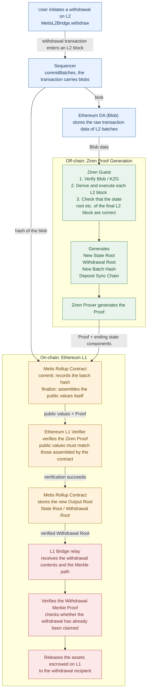

# End-to-end proof and withdrawal flow diagram for Metis + Ziren

```mermaid
flowchart TD
    U0["User initiates a withdrawal on L2<br/>MetisL2Bridge.withdraw"]
    S["Sequencer<br/>commitBatches, the transaction carries blobs"]
    A["Ethereum DA (Blob) <br/>stores the raw transaction data of L2 batches"]

    subgraph OFF["Off-chain: Ziren Proof Generation"]
        B["Ziren Guest<br/>1. Verify Blob / KZG<br/>2. Derive and execute each L2 block <br> 3. Check that the state root etc. of the final L2 block are correct"]
        C["Generates<br/>New State Root<br/>Withdrawal Root<br/>New Batch Hash<br/>Deposit Sync Chain"]
        D["Ziren Prover generates the Proof"]
        B --> C --> D
    end

    subgraph L1["On-chain: Ethereum L1"]
        G0["Metis Rollup Contract<br/>commit: records the batch hash<br/>finalize: assembles the public values itself"]
        F["Ethereum L1 Verifier<br/>verifies the Ziren Proof<br/>public values must match those assembled by the contract"]
        G["Metis Rollup Contract<br/>stores the new Output Root<br/>State Root / Withdrawal Root"]
        H["L1 Bridge relay<br/>receives the withdrawal contents and the Merkle path"]
        I["Verifies the Withdrawal Merkle Proof<br/>checks whether the withdrawal has already been claimed"]
        J["Releases the assets escrowed on L1<br/>to the withdrawal recipient"]
        G0 -->|public values + Proof| F
        F -->|verification succeeds| G
        G -->|verified Withdrawal Root| H
        H --> I --> J
    end

    U0 -->|withdrawal transaction enters an L2 block| S
    S -->|blob| A
    S -->|hash of the blob| G0
    A -->|Blob data| B
    D -->|Proof + ending state components| G0

    classDef data fill:#e8f1ff,stroke:#3973ac,color:#17365d
    classDef compute fill:#e9f5ec,stroke:#43875a,color:#194d2b
    classDef verify fill:#fff2dc,stroke:#b77a24,color:#68420c
    classDef asset fill:#fce8e8,stroke:#b94a48,color:#702c2c

    class A data
    class B,C,D compute
    class F,G0,G verify
    class U0,S data
    class H,I,J asset

```

